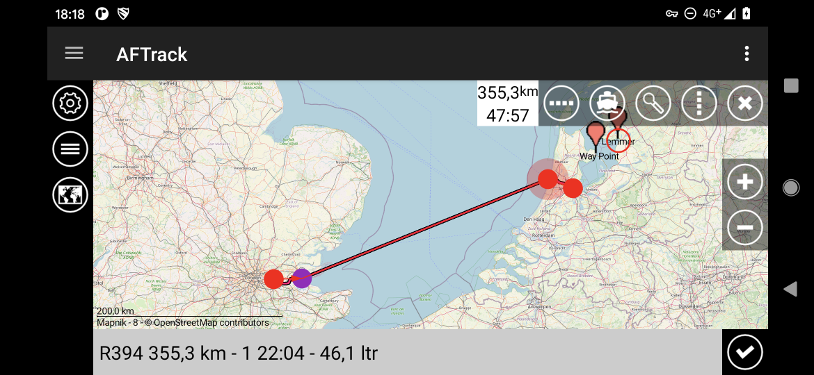
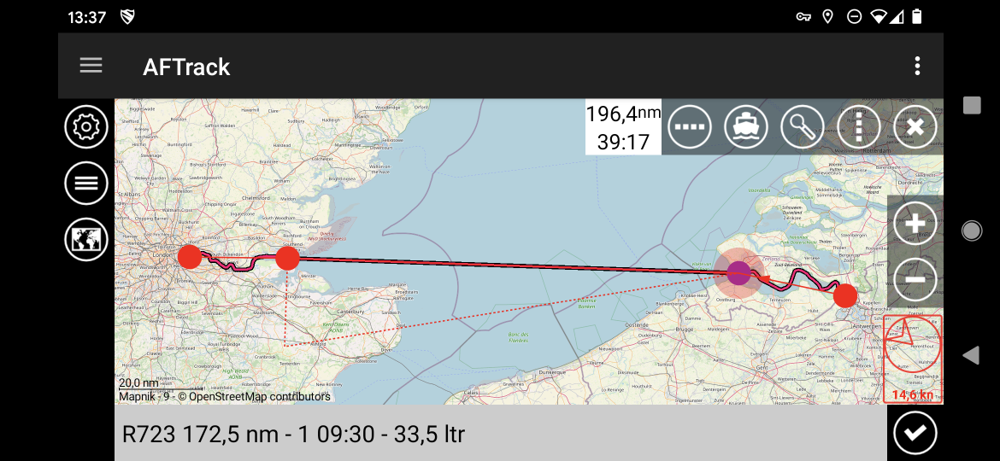

# AFTrack working with BRouter

This is based on the work of the BRouter project. Please see [Git](https://github.com/abrensch/brouter) 
and [Google Play](https://play.google.com/store/apps/details?id=btools.routingapp) or [F-Droid](https://f-droid.org/packages/btools.routingapp) for installation.

There are some files for use:
* waterway_nomod.brf    . works with standard lookup table and standard data files
* river_canoe_nomod.brf . works also with the standard (adapted from [river_poutnikl.brf](https://github.com/poutnikl/Brouter-profiles))
* lookups_all_mod.dat   . contains sample lookups for the next generation lookup table
* waterway_mod.brf      . works with a modified lookup table
* river_canoe_mod.brf   . needs a modification on lookup table
* river_canoe_future.brf  . needs more modification on lookup table with variable values
* waterway_future.brf   . contains some ideas, see brouter_one for more
* folder brouter_one contains an update for brouter classes, lookup and waterway.brf for that

With AFTrack since Oct 2020 comes a new BRouter handling. No direct interaction with BRouter profiles needed. 
After installation the file 'waterway_nomod.brf' is copied to the AFTrack folder.
This works with the standard lookups.dat tag table and comes with small waterway routing. 

With AFTrack version 1.12.0 (Jan 2021) comes an internal BRouter version that only works for waterways. It can download BRouter data files for US and Europe. These are very small and only contains the water routing data (e.g. E3_N50 = 3.4M / org. 131M). Please see it as a proof of concept.

To use all this inside AFTrack, do a long press on the map and select the ruler. It offers you two point to define start and end of a route. You can add points at the active point when you touch the second ring. Then select the routing mode and press the search button.  

There is now a setting dialog for the routing preferences.
By tap on a BRouter routing name you can define your favorite routing profile. 
To draw a new route when you move a routing point please select the checkbox 'Route direct'. The waterway routing has its own data files with width, height and depth on canal or rivers and other (Europe and North America only) - see project folder ['brouter one'](https://github.com/afischerdev/brouter-profile/tree/master/brouter_one).

And a work around for the calculation of splitted routes. Define a point as 'not routable' (coloar changes) and the distance is calculated direct.

This can be combined with wind routing. Attention, the routing with wind is ideal - only one angle related to the wind. There are also currents, changes in wind direction and other things.

river.brf is a template from BRouter project for own experiments.

[AFTrack Homepage](https://afischer-online.de/and/aftrack/) to get more info about AFTrack

[AFTrack Sailing Page](https://afischer-online.de/and/aftrack/sailing/) to get more info about AFTrack and sailing
