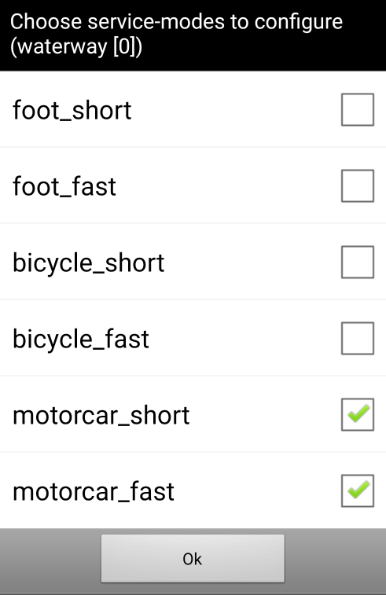

# AFTrack working with BRouter

This is based on the work of the BRouter project. Please see [Git](https://github.com/abrensch/brouter) 
and [Google Play](https://play.google.com/store/apps/details?id=btools.routingapp) or [F-Droid](https://f-droid.org/packages/btools.routingapp) for installation.

There are some files for use:
* waterway.brf                 works with standard lookup table and standard data files
* waterway_mod.brf             works with lookup_mod table and standard data files
* waterway_future.brf          needs new data files and new lookup table, should work wiht CEMT definitions

After installation copy the files waterway.brf to the brouter/profiles2 folder.
This works with the standard lookups.dat tag table. To get some more option you need to copy lookups_mod.dat and waterway_mod.brf and rename lookups.dat.

Then start BRouter as server. You are asked for a routing script selection, select waterway. BRouter supports at this moment only foot, bicycle and motorcar. So please check the motorcar_short and motorcar_fast or one of them. AFTrack will use this entry to BRouter.

When you are looking for smaller boats like canoe please use the river_canoe.brf. This is a copy of [Git](https://github.com/poutnikl/Brouter-profiles).

river.brf is a template from BRouter project for own experiments.

To use all this inside AFTrack, do a long press on the map and select the ruler. It offers you two point to define start and end of a route. You can add points at the active point when you touch the second ring. Then select the routing mode and press the search button.  

[AFTrack Homepage](https://afischer-online.de/and/aftrack/) to get more info about AFTrack

[AFTrack Sailing Page](https://afischer-online.de/and/aftrack/sailing/) to get more info about AFTrack and sailing
