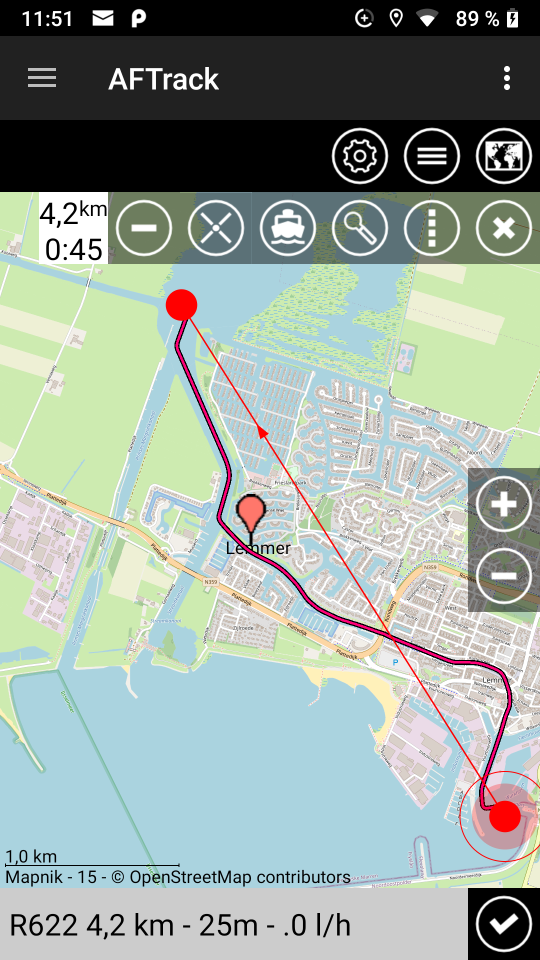
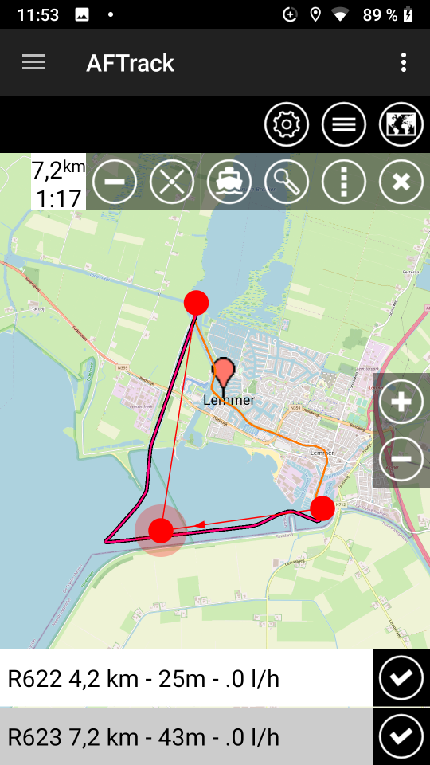
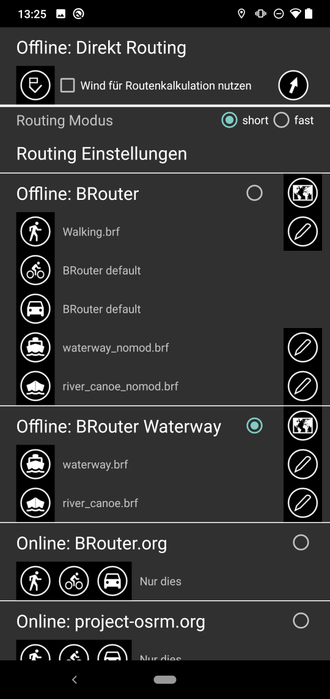

# AFTrack working with BRouter

This is based on the work of the BRouter project. Please see [Git](https://github.com/abrensch/brouter) 
and [Google Play](https://play.google.com/store/apps/details?id=btools.routingapp) or [F-Droid](https://f-droid.org/packages/btools.routingapp) for installation.

There are some files for use:
* waterway_nomod.brf . works with standard lookup table and standard data files
* waterway_future.brf . contains some ideas, see brouter_one for more
* folder brouter_one contains an update for brouter classes, lookup and waterway.brf for that

With AFTrack since Oct 2020 comes a new BRouter handling. No direct interaction with BRouter profiles needed. 
After installation the file 'waterway_nomod.brf' is copied to the AFTrack folder.
This works with the standard lookups.dat tag table and comes with small waterway routing. 

To use all this inside AFTrack, do a long press on the map and select the ruler. It offers you two point to define start and end of a route. You can add points at the active point when you touch the second ring. Then select the routing mode and press the search button.  

There is now a setting dialog for the routing preferences.
By tap on a BRouter routing name you can define your favorite routing profile. 
To draw a new route when you move a routing point please select the checkbox 'Route direct'.

When you are looking for smaller boats like canoe please use the river_canoe.brf. This is a copy of [Git](https://github.com/poutnikl/Brouter-profiles).

river.brf is a template from BRouter project for own experiments.

[AFTrack Homepage](https://afischer-online.de/and/aftrack/) to get more info about AFTrack

[AFTrack Sailing Page](https://afischer-online.de/and/aftrack/sailing/) to get more info about AFTrack and sailing
